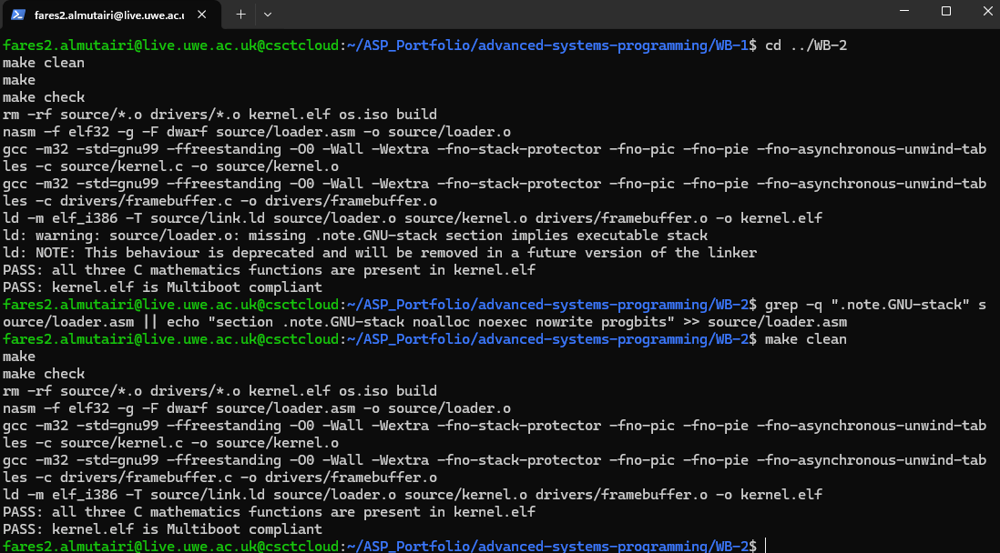
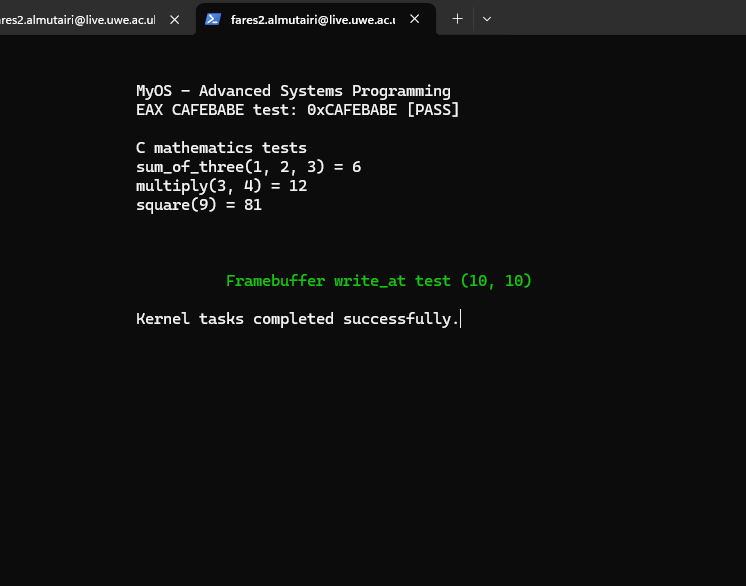

# MyOS — Coursework Tasks 1–4

**Student:** Fares Almutairi  
**Student ID:** 23072137  
**Module:** MyOS (`UFMFGT-15-1`)

## Overview

This repository implements a small 32-bit freestanding kernel using NASM and C.
It contains the Multiboot/GRUB setup, linker script, stack initialisation,
Assembly-to-C entry path, three required C mathematics functions and a VGA text
framebuffer driver. The kernel was built, checked and run on
`csctcloud.uwe.ac.uk`.

## Repository structure

```text
.
├── README.md
├── Makefile
├── .gitignore
├── evidence/
├── boot/
│   └── grub/grub.cfg
├── source/
│   ├── loader.asm
│   ├── kernel.c
│   └── link.ld
└── drivers/
    ├── framebuffer.c
    └── framebuffer.h
```

## Task 1 — Bootloader, GRUB, Multiboot and linking

- Valid Multiboot header and checksum.
- GRUB configuration in `boot/grub/grub.cfg`.
- Linker script placing the kernel at 1 MiB.
- `0xCAFEBABE` loaded into `EAX` in `loader.asm`.
- Boot marker passed from Assembly to `kernel_main()` and displayed as
  `0xCAFEBABE [PASS]`.

## Task 2 — Stack, `kernel_main()` and C functions

- Private 16 KiB kernel stack aligned to 16 bytes.
- 32-bit cdecl call from Assembly to C.
- Externally visible functions:
  - `sum_of_three(1, 2, 3) = 6`
  - `multiply(3, 4) = 12`
  - `square(9) = 81`
- `-O0` is used so the required function symbols remain inspectable in
  `kernel.elf`.

## Task 3 — Framebuffer driver

The VGA text-mode driver supports:

- clear screen;
- write one character;
- write a null-terminated string;
- foreground/background colour selection;
- hardware cursor movement;
- text output at a specified `(x, y)` coordinate;
- signed decimal and hexadecimal output;
- newline, carriage return, tab and backspace handling;
- line wrapping and scrolling.

The runtime demonstration writes the green coordinate-test message at
`(10, 10)`.

## Build and verification

Requirements: NASM, GCC with 32-bit support, GNU `ld`, `grub-file`, GNU Make
and QEMU.

```bash
make clean
make
make check
```

`make check` verifies both of the following:

```text
PASS: all three C mathematics functions are present in kernel.elf
PASS: kernel.elf is Multiboot compliant
```

### Direct QEMU run

The direct run does not require an ISO-building package:

```bash
make run-direct
```

For an SSH terminal:

```bash
make run-curses
```

Equivalent command used during testing:

```bash
qemu-system-i386 -kernel kernel.elf -m 32 -display curses
```

### GRUB ISO build

A bootable GRUB ISO can be created where `grub-mkrescue` and `xorriso` are
installed:

```bash
make os.iso
make run-iso
```

During the documented CSCT Cloud session, `xorriso` was unavailable, so the
kernel was executed directly with QEMU after the Multiboot compliance check.
The GRUB configuration and ISO target remain included for an environment that
provides the dependency.

## Testing summary

| Test | Method | Observed result | Status |
|---|---|---|---|
| Required symbols | `make check` / `nm` | All three C functions present | Pass |
| Multiboot format | `grub-file` | `kernel.elf` compliant | Pass |
| Assembly-to-C marker | QEMU | `0xCAFEBABE [PASS]` | Pass |
| C functions | QEMU | `6`, `12`, `81` | Pass |
| Framebuffer string output | QEMU | Clear readable output | Pass |
| Positioned output | QEMU | Green text at `(10, 10)` | Pass |
| Kernel completion | QEMU | Completion message displayed | Pass |

## Evidence

### Clean build and checks



### Running kernel



## Reflection

A freestanding kernel cannot use normal operating-system services, so the C
sources are compiled without the standard runtime and linked through a custom
linker script. The Multiboot header must remain near the beginning of the ELF
file so GRUB and `grub-file` can recognise it. The framebuffer driver writes
character/attribute pairs directly to VGA memory and updates the hardware
cursor through I/O ports. Bounds checks, wrapping and scrolling prevent output
from moving outside the 80 by 25 text buffer.

## Submission details

- **Repository URL:** Add after creating the GitHub/GitLab repository.
- **Demonstration video URL:** Add after uploading the required face-and-screen recording.
- **Collaboration and tool declaration:** Complete truthfully in accordance with the module's academic-conduct requirements before submission.

## References

- GNU GRUB Multiboot specification and documentation.
- OSDev Wiki, *Meaty Skeleton* and VGA text-mode material.
- Advanced Systems Programming lecture and worksheet material.
